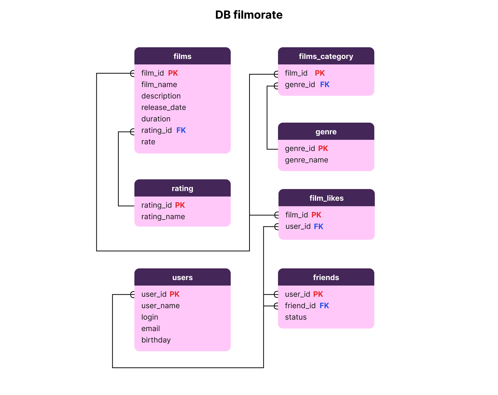

# java-filmorate

## ER-диаграмма базы данных


## Описание таблиц
### films
- film_id - первичный ключ, идентификатор фильма;
- film_name - название фильма;
- description - описание фильма;
- release_date - дата выхода фильма;
- duration - продолжительность фильма в минутах;
- rating_id - внешний ключ, идентификатор рейтинга MPA (таблица "rating");
- rate - рейтинг фильма, вычисляемый как сумма значений из таблицы "film_likes".

### rating
- rating_id - первичный ключ, идентификатор рейтинга MPA;
- rating_name - название рейтинга MPA ("G", "PG", "PG-13" и др.).

### films_category
- film_id - первичный ключ, идентификатор фильма;
- genre_id - внешний ключ, идентификатор жанра (таблица "genre").

### genre
- genre_id - первичный ключ, идентификатор жанра;
- genre_name - название жанра ("Боевик", "Комедия" и др.).

### film_likes
- film_id - первичный ключ, идентификатор фильма;
- user_id - внешний ключ, идентификатор пользователя (таблица "users").

### users
- user_id - первичный ключ, идентификатор пользователя;
- user_name - имя пользователя;
- login - логин пользователя;
- email - адрес электронной почты;
- birthday - дата рождения.

### friends
- user_id - первичный ключ, идентификатор пользователя;
- friend_id - внешний ключ, идентификатор пользователя (таблица "users");
- status - статус заявки в друзья ("confirmed" - подтвержденная, "unconfirmed" - неподтвержденная заявка).

### Примеры запросов:

#### 1. Пользователи

создание пользователя

```
INSERT INTO users (name, email, login, birthday)
VALUES ( ?, ?, ?, ? );
```

редактирование профиля пользователя

```
UPDATE users
SET email = ?,
login = ?,
name = ?,
birthday = ?
WHERE user_id = ?
```

получение списка всех пользователей

```
SELECT *
FROM users
```

получение пользователя по id

```
SELECT *
FROM users
WHERE user_id = ?
```

добавление в друзья

```
INSERT INTO friends (user_id, friend_id)
VALUES (?, ?)
```

удаление из друзей

```
DELETE
FROM friends
WHERE user_id = ? AND friend_id = ?
```

получение списка пользователей, являющихся его друзьями

```
SELECT users.*
FROM users
INNER JOIN friends ON users.user_id = friends.friend_id
WHERE friends.user_id = ?
```

список друзей, общих с другим пользователем

```
SELECT users.*
FROM users
INNER JOIN friends ON users.user_id = friends.friend_id
WHERE friends.user_id = ?
INTERSECT
SELECT users.*
FROM users
INNER JOIN friends ON users.user_id = friends.friend_id
WHERE friends.user_id = ?
```

#### 2. Фильмы

создание фильма

```
INSERT INTO films (name, description, release_date, duration, rating_id)
VALUES (?, ?, ?, ?, ?)
```

редактирование фильма

```
UPDATE films
SET name = ?,
description = ?,
release_date = ?,
duration = ?,
rating_id = ?
WHERE film_id = ?
```

получение списка всех фильмов

```
SELECT films.*, rating.name, COUNT(film_likes.user_id) AS rate
FROM films
LEFT JOIN rating ON films.rating_id = rating.rating_id
LEFT JOIN film_likes ON films.film_id = film_likes.film_id
GROUP BY films.film_id
ORDER BY films.film_id
```

получение фильма по id

```
SELECT *
FROM films
WHERE films.film_id = ?
```

пользователь ставит лайк фильму

```
INSERT INTO film_likes (film_id, user_id)
VALUES (?, ?)
```

пользователь удаляет лайк

```
DELETE
FROM film_likes
WHERE film_id = ? AND user_id = ?
```

возвращает список из первых count фильмов по количеству лайков

```
SELECT *
FROM films
ORDER BY rate DESC
LIMIT count
```
